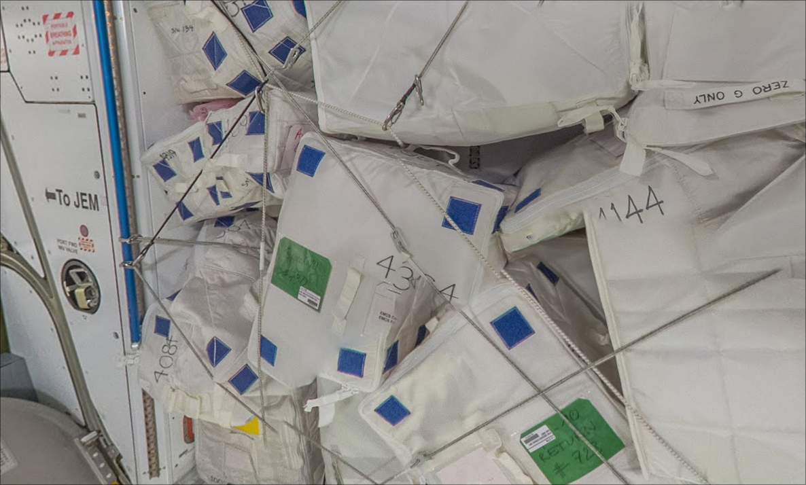
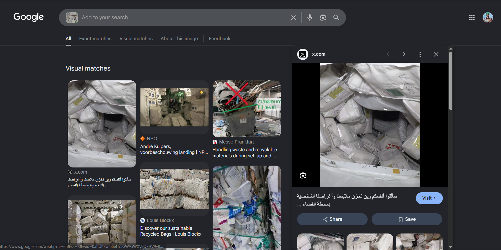
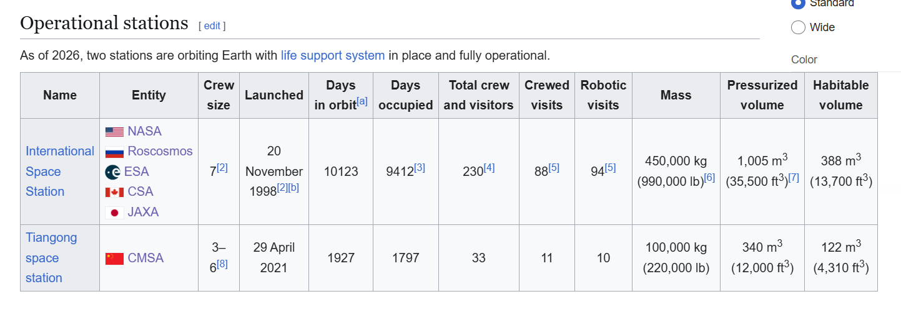
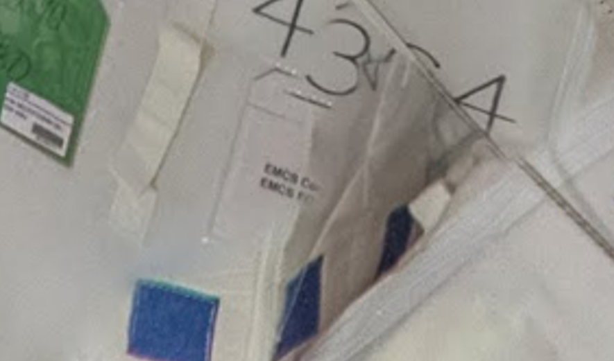
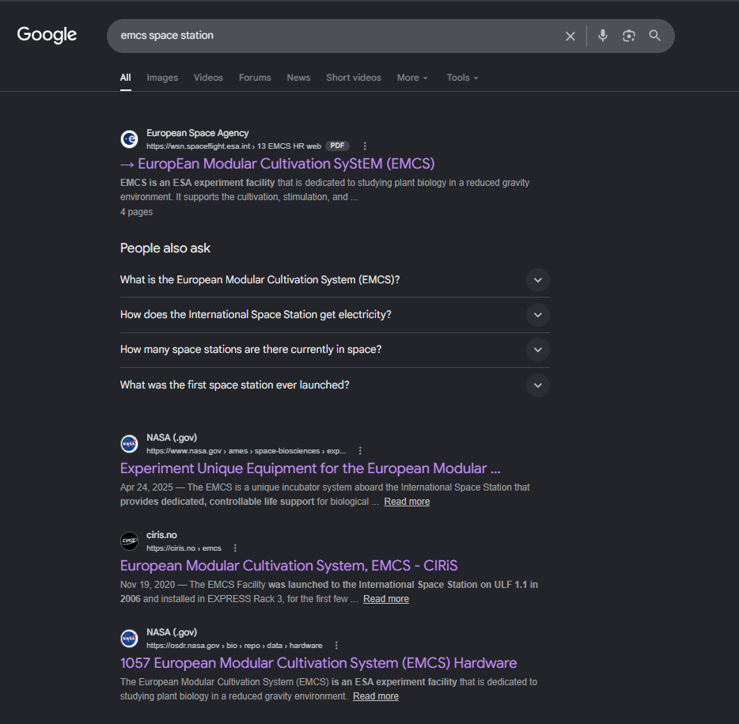
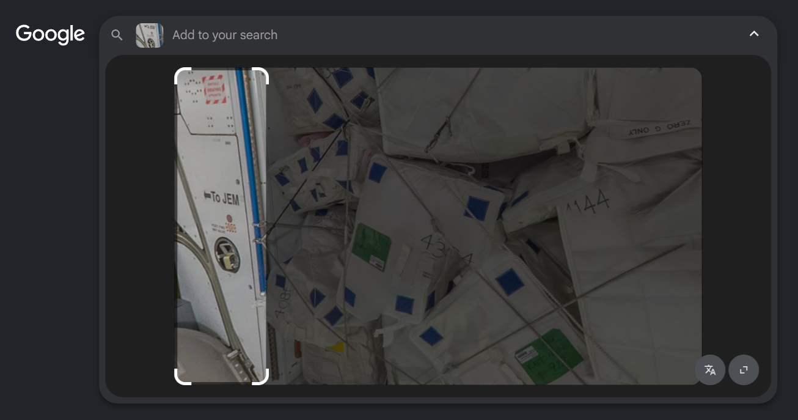
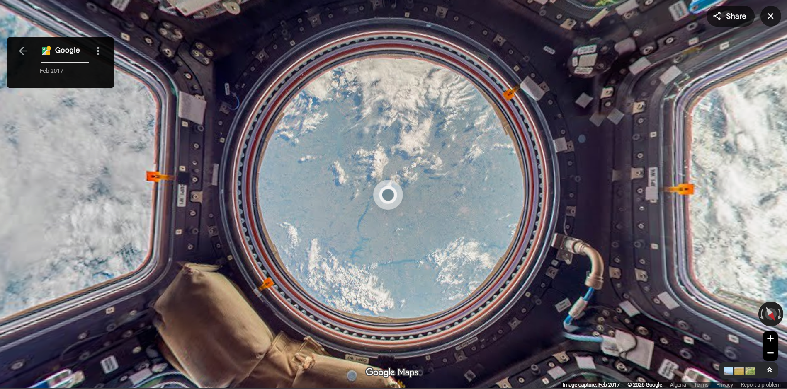
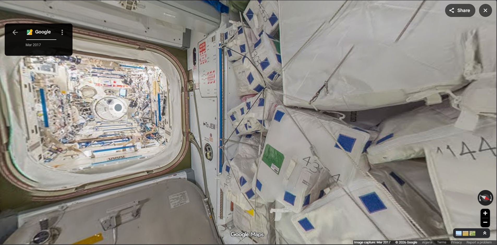

+++
date = '2026-08-08'
draft = false
title = 'AM ABOVE WHAT ?!'
categories = ["OSINT","FLAGS"]
summary = "geolocate a photo that turns out to be taken from space station, find precise coordinates for the flag."
+++

**Challenge:**

Who tf makes osint challs like this, flag format
ITC{xx.xxxxxxx,xxx.xxxxxxx}

---

So first of all, the usual move try and search the photo in google image
search

The first result is about an astronaut showing the storage
of their space station, and in the video the bags looks very similar to
the bags in our photo

<https://x.com/Astro_Alneyadi/status/1678370128352747521>

moving on, in the photo there is a phrase I noticed "ZERO G ONLY", you
gotta flip the photo to read it

google this up and all results you will see are about space and
astronomy, so now im certain that this place is inside a space station

then I went to google I searched all space stations in the worlds and
found this Wikipedia page

<https://en.wikipedia.org/wiki/List_of_space_stations>

Well it clearly says "As of 2026, two stations are orbiting Earth" idk
why the hell Ive gone looking for the 6 space entities in google maps
(brilliant move)

I even used google street view there like I was looking for a space
station in every spaceport/rocket launch site cuz I thought the space
station is in earth (honestly idk what I was thinking im as shocked as u
are buddy) and oh, believe me you don't wanna know how many hours I
wasted here and how many spaceports I went to throw google street view

so after too many wasted hours, my brain decided to think and I got back
to the photo tryna figure out any other clues that can lead me to which
space station is this (it clearly says ISS in the previous wiki page but
nvm I needed which station to keep looking in spaceports on street view)
and I saw this small ticket on one of the bags

Its written "EMCS", I went to google and searched "emcs space station"

So shortly EMCS is "an Experiment facility for plant biology research on
the International Space Station"

AGAIN IT CLEARLY says "International Space Station", and ya ofc my last
remaining brain cell tells me to go read all of those scientific
doucements to figure out which space station it is, idk why in earth I
spent hours looking into scientific doucements about EMCS and try to
understand what is that operation, and im not even joking I can write a
whole article about that operation and all the details about it from
where it started to how it ended

So ya what I was thinking is "I gotta figure which spaceport this space
station is in and which entity is responsible for it so I know where to
look in google street view, cuz in Wikipedia I found hundreds of
spaceports so I gotta know which entity is responsible for the launch
and everything so I can go to their launch sites and I shall find the
street view time history which will let me explore the place in
different years and I should be able to find this space station there"

Brilliant isn't it ? lol. ig im a certified professional overthinker
they should call me the CEO of terrible ideas

So lemme continue the disaster I started, after going throw several docs
I found that EMCS launched in 2006 from Kennedy Space Center in Florida
and NASA was the entity responsible for it and ofc I went to street view
looking over there and spent several hours running around

After that I said screw it ima look at every space station in usa, but
before that i tried something, I went back to google image search I
searched for this

I tried searching for this cabinet and it showed me a video of a space
station in yt shorts

<https://www.youtube.com/shorts/SJ0-Q_3IVks>

and guess what, it has the same exact cabinet and bags in our photo,
after translating the description the space station name in the video
was "Boeing Starliner", searched it up and if it had
carried emcs before but no result + her bags storage was way smaller
than the one in the photo

so afetr all that disaster ive been throw I got tired, and I went to
play a "Loup-Garou" party which lasted 3-hours. And ya ofc we "SVs" won.

Anyway I completely forgot about the challenge and when I got back
opened my pc I stared at it for some time and idk how I thought of this:
"this is a space station right ? idk how there gonna be a street view
inside it but why don't I try searching for all street view available
for space stations in google"

And guess what, IT DID WORK HAHA first result was a the link to the ISS
street view

In the most unexpected way lol, I was looking at spaceports the whole
time while I was able to search that from the beginning since the
station name was in Wikipedia but ya had to let my inner NPC cook

So after I got lost for a while inside the ISS I finally found the flag

which is
itc{ 29.5594034,-95.0871548}
