+++
date = '2026-08-07T18:22:08+01:00'
draft = false
title = 'EyeInSky'
categories = ["OSINT","NMCTF"]
summary = "Geolocating a surveillance camera from a single street-level photo to identify the site of a kidnapping."
+++

**Note:**

So before I start with anything I gotta mention that this approach I took is maybe the hardest and longest one (it clearly the hardest, took me 30hr lol), if you use Yandex search and maps you may get to the flag easily and quicker than I did, so lets start.

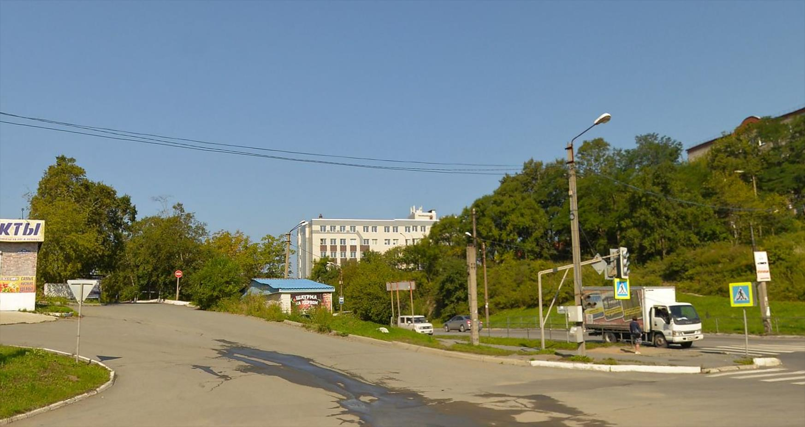

**Challenge:**

A kidnapping has taken place near the location shown in the attached photograph. The image was obtained from a witness who was in the area moments before the incident occurred.

Your mission is to identify the surveillance camera that may have captured the incident, and the building it is mounted on.

You must determine:
The full address of the building the camera is installed on
Who operates the camera

Flag format: `nmctf{Building_Address, Operator_Name}`

So the usual move, I placed the image in Google Lens (you should try Yandex image search) to try to find it or maybe find a nearby place to it but got nothing useful, And judging from the shop's board you can clearly see that they are written in Russian

Then this building caught my attention, judging from the appearance I thought it should be in either Moscow or Saint Petersburg, so I tried searching for similar buildings in Moscow or Saint Petersburg (with the help of google lens ofc), it took me some hours and turns out to be a waste of time.

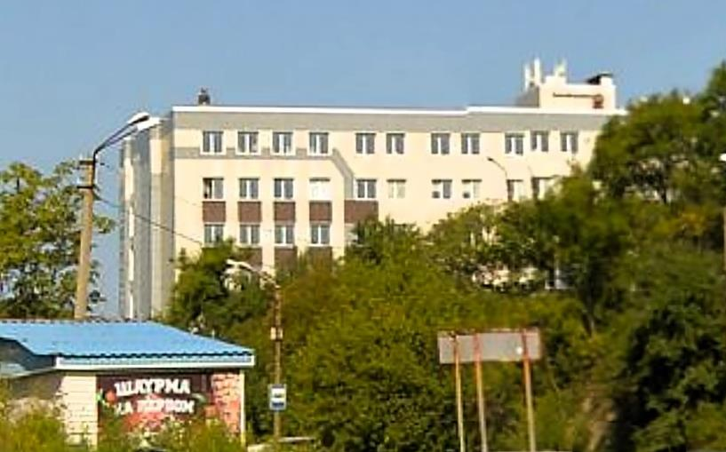

So next I started looking for some other clues which are those two


**First one:**

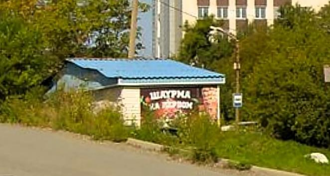

if you look closely you can read the first word "ШАУРМА" which translate to "Shawarma" so we know there is a Shawarma restaurant near the place

and I used this website that provide Russian keyboard so I can type the letters as I see them: https://russian.typeit.org/

**Second one:**

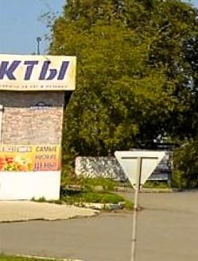

Well that's clearly an uncompleted word, using the same website I used before, the last letter of that word are three letters "КТЫ"

So to figure out what that building could be I need to know whats written in the shop's board, so I used that site to search for all Russian words that end in "КТЫ"

https://www.wordmine.info/russian/words-ending-in?query=КТЫ

and also if we look closely below there are a blurred board with other Russian words, but in the board we can see something that looks like fruits and vegetables, and ya my guess is right, fruits in Russian is "фрукты" and it ends with "кты"

and I also used this website https://www.russiancorrector.com/ that correct the Russian words so I know that I typed the word correctly

so now we know that there is a Shawarma restaurant and fruits shop near the location we looking for, but since Russia is too fucking big and I had no clue where to look exactly I still had my thought of it being in Moscow or Saint Petersburg and with the two clues I found I said why not looking a second time so I looked for all the Shawarma restaurants and fruits shops in the maps and in the advertising websites and ya as "not expected" lol, another couple hours wasted for nothing

so I had to figure out a clue that can tell me which side or area of the country I should search in, then I noticed something in the vehicles in the photo

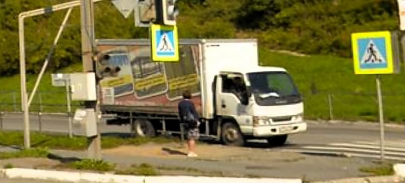

Russia drive in the **right-hand side** of the road but this truck has it driving wheel in the right seat (it should be in left seat), that a strong clue, so after a little search in google, reddit and quora I found that "far east Russia" import cars from Japan (which is **a left-driving side** country)

You can check:

1. https://www.worldstandards.eu/cars/list-of-left-driving-countries/
2. https://www.quora.com/How-common-is-it-to-see-right-hand-drive-vehicles-in-Russia-Far-East-I-have-seen-them-three-times-in-two-unrelated-programmes-on-the-Russian-Far-East
3. https://www.reddit.com/r/geoguessr/comments/zm3zbz/left_side_driving_with_russian_looking_letters/
4. https://www.quora.com/Why-do-Russians-buy-right-hand-used-vehicles-from-Japan-While-in-Russia-they-use-left-hand-steering-cars-on-the-roads
5. https://www.reddit.com/r/MapPorn/comments/1ap4ib6/share_of_righthand_drive_jdm_cars_in_russia/#lightbox

in the last link you can see this map, a map of places with most right-drive wheel vehicles in Russia, far east Russia is the most common:

> Amur Oblast
>
> Khabarovsk
>
> Jewish Autonomous Oblast
>
> Primorsky Krai
>
> Sakhalin

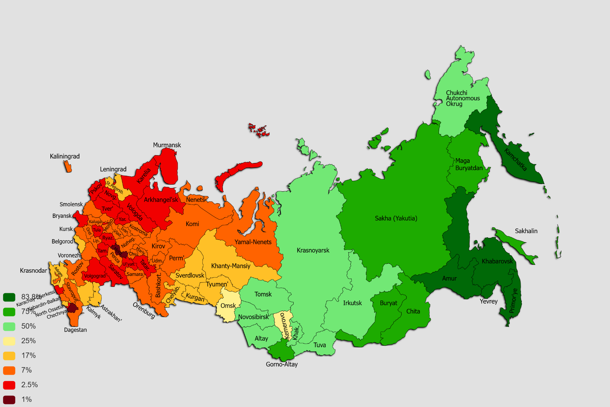

So now as we have less area to look into, I went straight to search for all Shawarma restaurants and fruits shops, looked at all of them but I didn't found the place

It seems like I was very close but yet too far, I needed another clue, something kinda unique of that place if you read the challenge again you'll notice that he mentioned a camera near the place, a camera that captured the kidnapping so if we searched for all the cameras in far east Russia we surely would get to the place

So first I thought of using any site that provide access to the cameras online, the only problem is there are many sites and there is a possibility that the specific camera that we looking for isn't in those website but I had to give it a shoot

https://www.geocam.ru/en/in/dvfo/

I used GeoCam which provide access to a total of 51 camera across far east Russia, after looking carefully "twice" on all cameras I didn't find the place, tried other website with no results, most of them were either broken, don't work or there aren't many cameras

So I had to find another way or some tool to help me find every single camera on that area, I found a tool named **Overpass Turbo** which is an OSINT tool, you can read further about the tool here:

https://hackers-arise.com/osint-finding-surveillance-cameras-with-overpass-turbo/

we will use it to extract all cameras locations from a specific area that we want

https://overpass-turbo.eu/

so first we have to write a script to extract all cameras, read this wiki page to understand how to write that script, it very simple and the syntax is actually very easy

https://wiki.openstreetmap.org/wiki/Overpass_turbo/Wizard

and here is the script

```text
[out:json][timeout:25];
nwr["man_made"="surveillance"]({{bbox}});
out geom;
```

When you access the website select the square manually on the place you wanna search in cameras for, don't forget we have 5 areas to look into

> Amur Oblast
>
> Khabarovsk
>
> Jewish Autonomous Oblast
>
> Primorsky Krai
>
> Sakhalin

So after looking at each one, I finally found the camera in **Primorsky Krai**

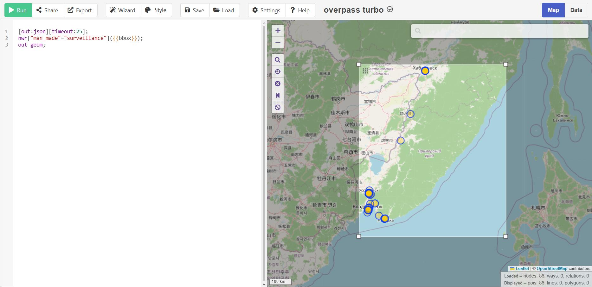

And this is the camera that we are looking for

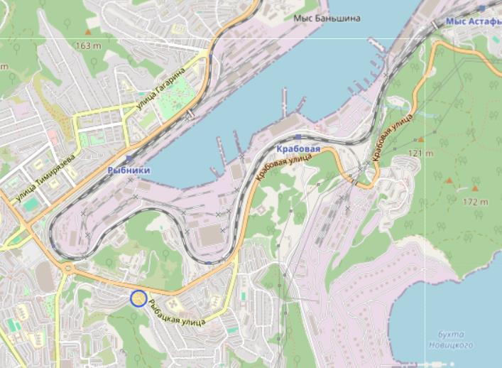

https://public.ivideon.com/camera/100-0Z6eGStQ6fYAawDXrrC5tO/0/?lang=en

here are google map coordinates: **42.7769394 132.8629342**

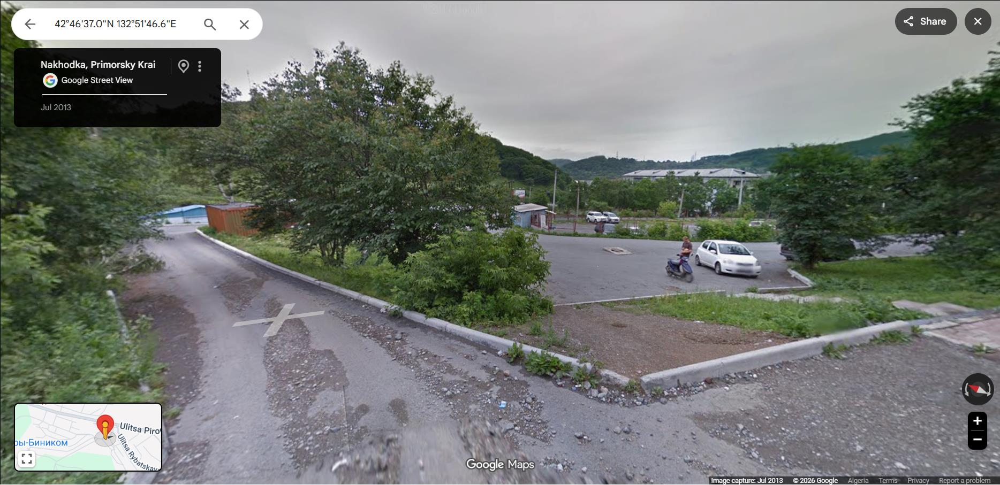

This is the place where the camera is placed, if you go the road ahead you'll notice that the place is the same that we are looking for

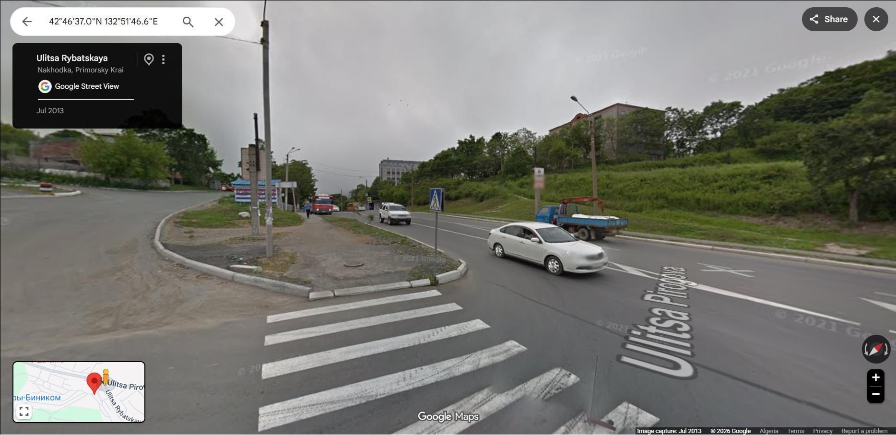

You can see that those two building are the same from the original photo, the shawarma restaurant and fruits shops seems to be gone

So ya, imagine spending 30hr only for the 2 fucking clues I was following in the beginning was actually gone (Peak Rage Baiting)

The address from Yandex map is:

Pirogova Street, 16, Nakhodka, Primorye Territory, 692921

Only thing left is the Opertaor Name, it easy:

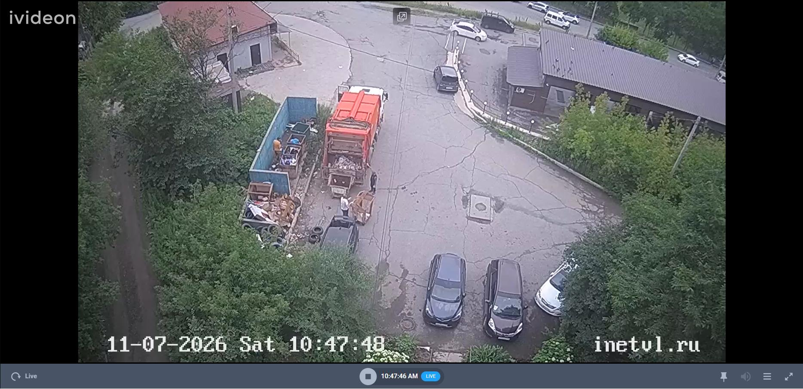

If you look in the camera footage you can see a link "inetvl.ru" it will take you to the survaillence camera operator website and you can read its name "Альянс Телеком" in Russian and if you translate it to English its "Alliance Telecom"

So combining the address and the operator name the flag is

`nmctf{Nakhodka_Pirogova_Street_16, Alliance_Telecom}`