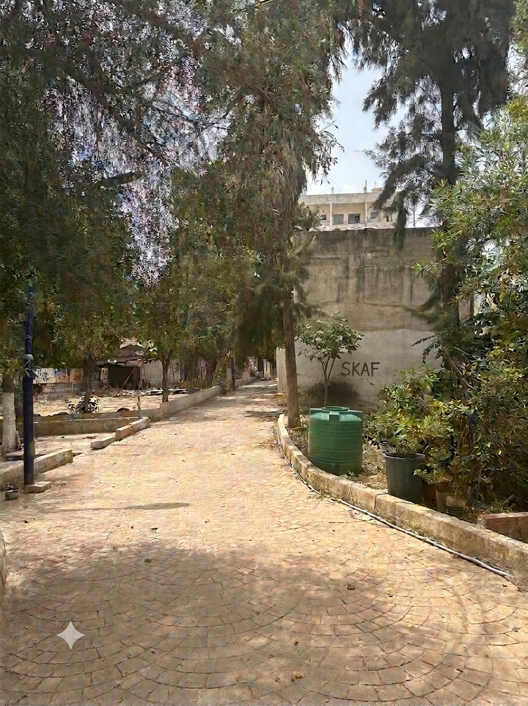
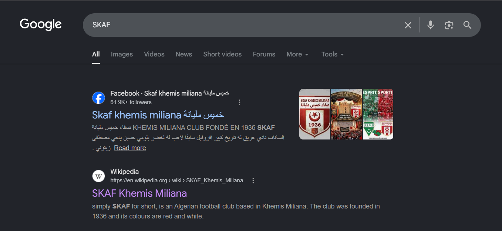
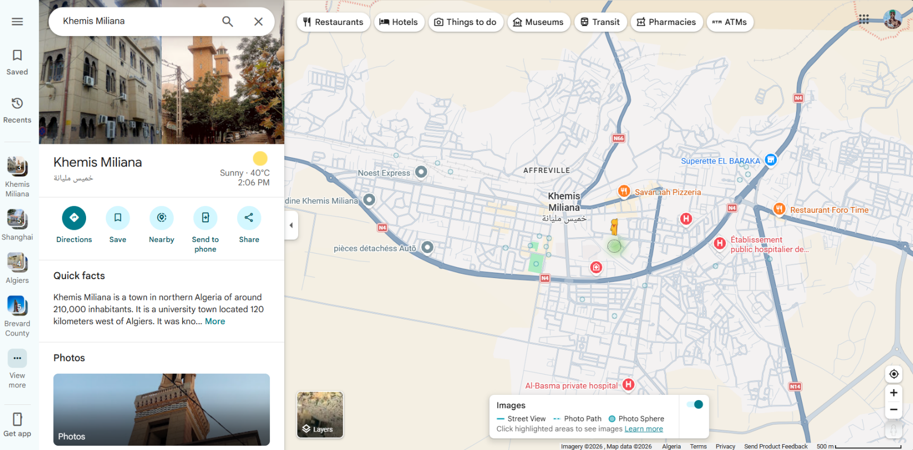
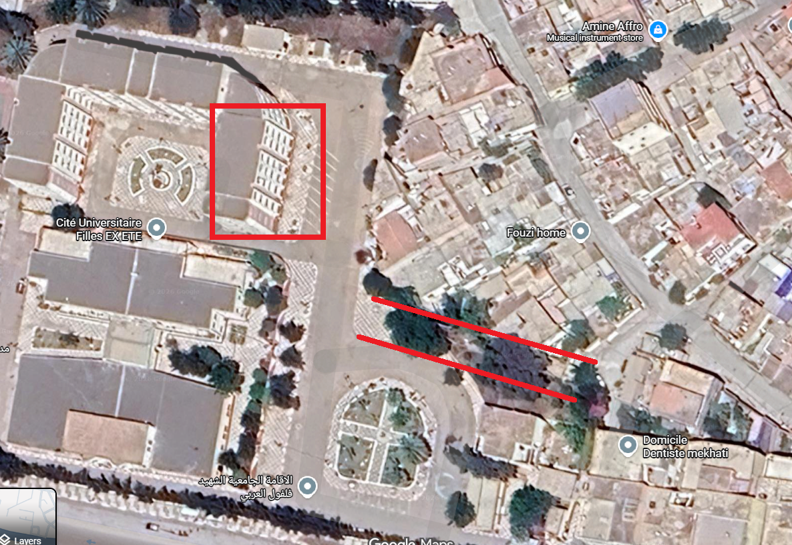
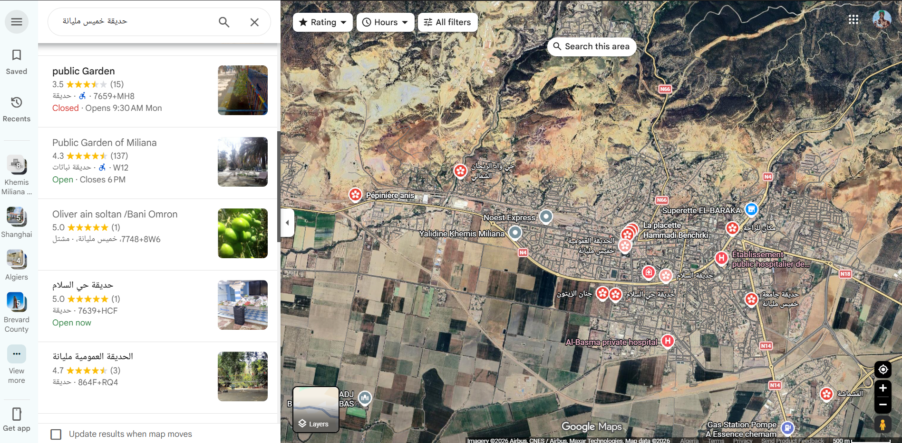
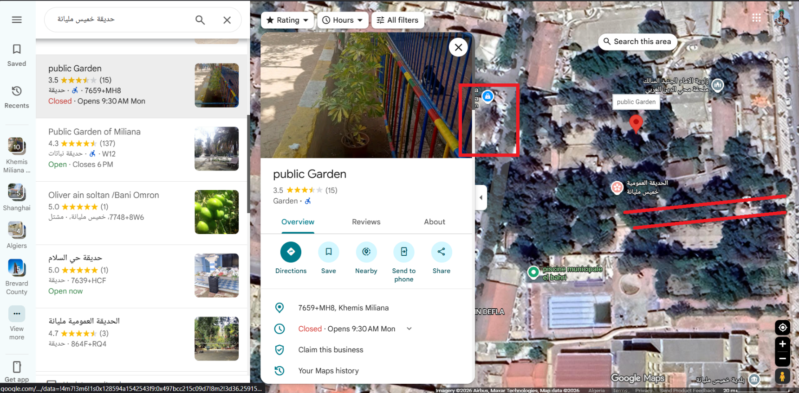
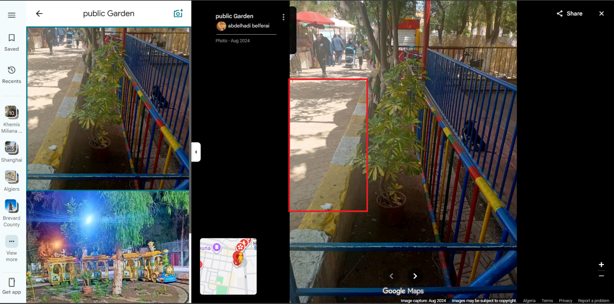
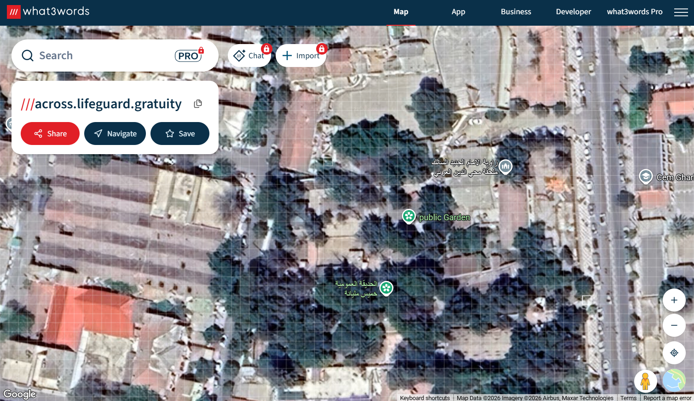

+++
date = '2026-08-08'
draft = false
title = 'Once Full of Life'
categories = ["OSINT","FLAGS"]
summary = "geolocate a photo with a \"SKAF\" wall marking to find its exact location and the assigned three-word answer."
+++

**Challenge:**

Analyze the provided image and determine the exact location to discover
the unique three-word assigned to it

Submit the flag in the format ITC{\...}.

---

Back at it again, another interesting OSINT challenge and ya lets start
with the usual move: google image search and as "not expected" lol, no
result

So ya lets look at the photo and try figure out some clues

We can see the word "SKAF" on the wall and after I googled it show us
"Khemis Miliana Football team" which is called "SKAF"

Cool, we know that the place is in Khemis Miliana, I went straight to
google maps and tried google street view there

There are several street view points in khemis Miliana, checked all of
them twice but none of them is the place we looking for

So went back to the picture, the only thing u can inference beside the
"SKAF" on the wall is that the place we looking for is a pedestrian
sidewalk covered by trees and faces a tall white (kinda) building

So I went back to google image search tried to find it maybe someone
posted it on facebook or I could find it some football social media
related to SKAF, but no result at the end

Then another author told me that this photo is taken from the author's
phone so it nowhere to be found on the internet

I tried exiftool on it maybe ill find location data but the photo was
edited with gemini so I found no useful data from exiftool

So last and only way to find is to go back to street view, change it
layer "satellite view" and look carefully until we find it

Our only clue is "a pedestrian sidewalk covered by trees and faces and
tall white building"

At first I randomly encounter this place

Looks exactly like what im looking for: a pedestrian sidewalk covered by
trees faces a white tall building, I thought that was it and I hit a
lucky shot out of nowhere but turns out the place is not the one we
looking for

So moving on I cant keep running around khemis Miliana randomly I needed
a hint, here when the author said that the place is a garden, that's a
strong hint cuz khemis Milana had around 10 gardens to look into

You know the Chinese proverb that say: "I show him the moon, and the
idiot looks at my finger" I guess im that idiot cuz I kept looking
around gardens INSTEAD of looking inside the gardens and that wasted me
a lot of time (like a loooot) until I asked the author again he told me
that the place is insdie a garden not outside

sometimes my own brilliant moves actually scare me

anyway lets continue, after looking into all the gardens only one match
the description we looking for which is this

It has a pedestrian sidewalk and a tall building facing it

And if you look at google map photos of the place you see something
interesting

The shape of the pavement is exactly like the one in the
original photo

So that's clearly the place we looking into and since this photo angel
is facing the entrance of the garden so thats mean the photo/place we looking for
was taken on the opposite angel of this

So now we have the garden, we need the 3 unique words that describe this
place I used this website which my teammate sent me, it convert any
coordinates on earth into a unique 3 words and that's what we looking
for

<https://what3words.com/trail.spoons.combos>

and here I tried to figure the exact square which the photo was taken
from, I spammed around 150 flag (sorry for that, glad it didn't take
down ur infra but I had no other choice lol)

I kept trying until the author told me ur far away, try look for the
entrance that is shown in the google map photos and figure out where it
is in this website, so I located the entrence and started from it and
boooom the first square I tried was the right flag (it was exactly the
entrance square)

So the final flag is

ITC{across_lifeguard_gratuity}
