+++
date = '2026-08-08'
draft = false
title = 'CHINA'
categories = ["OSINT","FLAGS"]
summary = "geolocate a photo of a very \"English-looking\" spot (red brick, chimneys, manicured lawn) with Chinese-language flavor text, hinting it's not actually in England."
+++

**Challenge:**

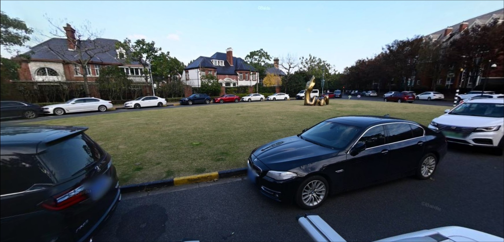{width="7.9375in"
height="3.8229166666666665in"}

多么英伦风情------红砖、烟囱、修剪得整整齐齐的草坪。

英伦得......有点可疑。

说说看，这个"英格兰"的角落到底在哪儿？

flag format \`ITC{xxxxxxxx.xxxxxxxx,xxxxxxx.xxxxxxxx}\`

---

Im sorry I yapped to much in this writeup it was my fav challenge in
this ctf I wanted to detail it a little bit. so Lets start, first when I
saw Chinese I went straight to google translate cuz obviously I wont
understand that lol

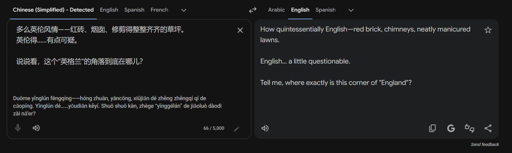

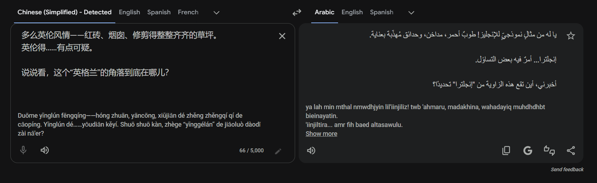

had to read that in both English and Arabic to understand it ngl

Anyway so the Chinese text tells that someone is seeing an England town
(cuz he is basically saying "English", if he was talking about an
American place he would simply say "American" to express it) and
expressing what he sees, here get the interesting part most
people here thought that the place is in England/UK but here I told
myself:

"guy is speaking Chinese and he's talking about some England town, I've
always heard of places called China Town in USA or England I don't
remember exactly where, so I immediately had a question in my head:
there are china towns in England/USA, so ya why not an England Town in
China ?"

Then I went straight to google and searched "all England towns in China"
and the first result was a Wikipedia page and reddit post of a town
named "Thames Town" in china

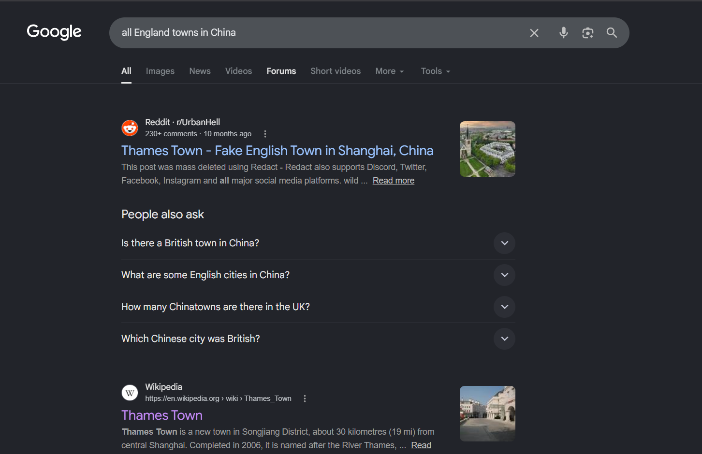

Cool, until here I got a place to look into I searched it into google
maps (that was ma biggest mistake in that challenge) and google maps
showed me the town but without borders (when I search a place in google
maps it used to draw a red dashed line to describe borders
of that place) so I thought that town maybe a huge place so I gotta
figure out another clue from the photo

I went to the photo again to try and figure some other clues, I zoomed
into the bmw and:

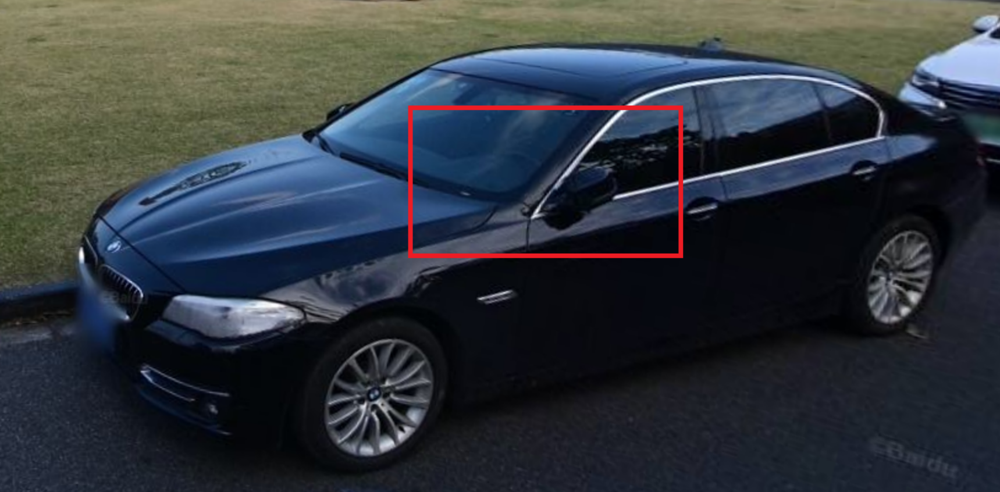
ya look what we have, you can see the driving-wheel on the left
(England/UK have their driving-wheel on the right-side).

Another thing I noticed is

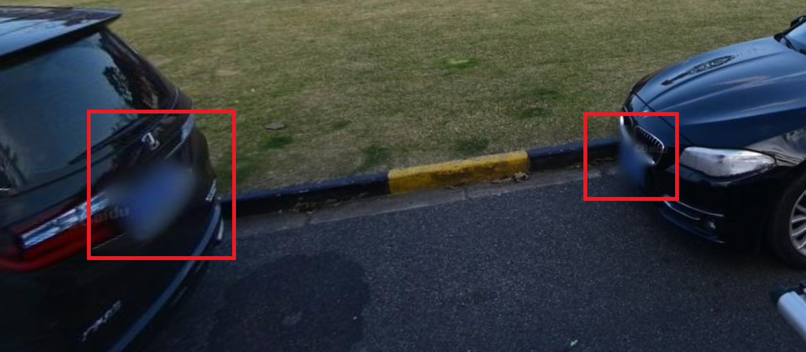
The cars plates are blurry but we can see they are blue and guess what,
china cars have blue plates (I knew that from insta reels so.. i guess the doom
scrolling hours on reels paid off after all, didn\'t they? lol)

So my previous belief that this place is in china was right

Ok ok I know I talked too much here about a simple point but that how I
thought and figured out the place, I know it too much yapping but in
reality I thought of all this in about 2-3 min

After that the author was passing by me and saw the Wikipedia page with
"Thames Town" on it and said "I like that name" so ya I was clearly
right about the town haha

Until here I was ahead of everyone, I wanted to first blood that but I
got lost after that

I kept searching that photo in google image search but no result or
similar place appeared, so I tried using a Chinese image search, I used
"Baidu"

<https://image.baidu.com/>

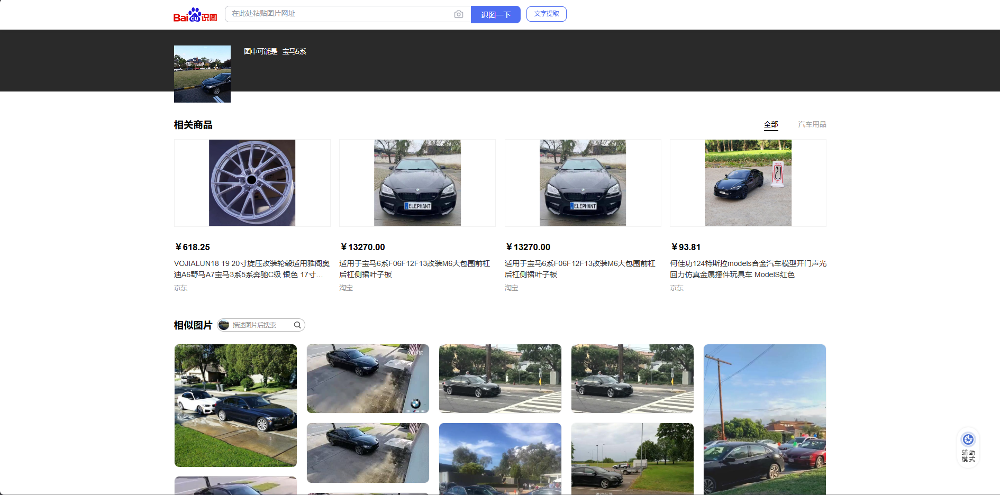
I placed the whole image there but kept showing a whole feed of cars and BMWs
so gotta change or search something else

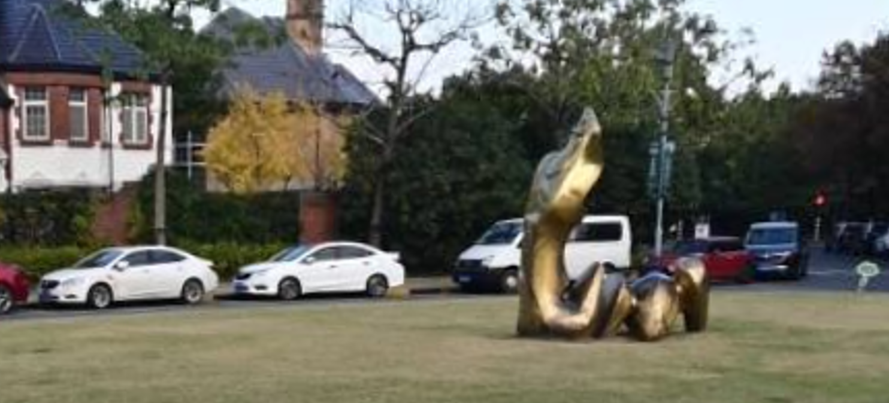

There is snake statue in the middle so I tried searching with it

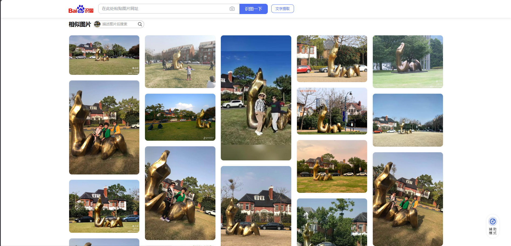

And ya there was A LOT of people who took pics with this snake and
posted it and if you inspect any of those photos you'll see that it the
same place that we looking for

For exemple

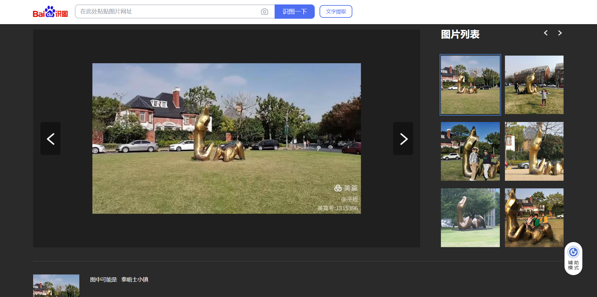

So I kept running around between those pics searching for someone who
mentioned this exact specific place where this snake is located, not
only mentioning "Thames Town" and ya the only thing mentioned in all of
these photos was "Thames Town"

I kept looking for a more specific identification of the place cuz I
thought Thames town is a huge Town

Then I went back to google maps and tried street view in Thames Town
(dumbest move ever)

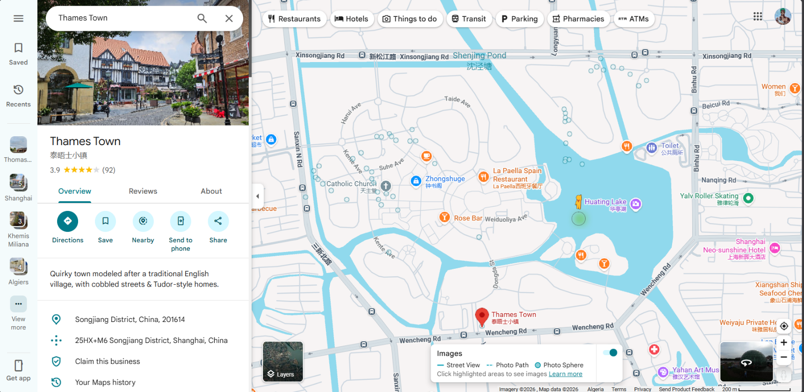

Too many view points near Thames town, looked at of them but none of
them matched the place i was looking for (first blood was gone by the
time I got here)

I wasted a lot of time for nothing until finally I thought of using the
china local maps service, the map services I found were "QQ maps" and
"Baidu maps" I used Baidu since I didnt know how to use QQ maps

<https://map.baidu.com/>

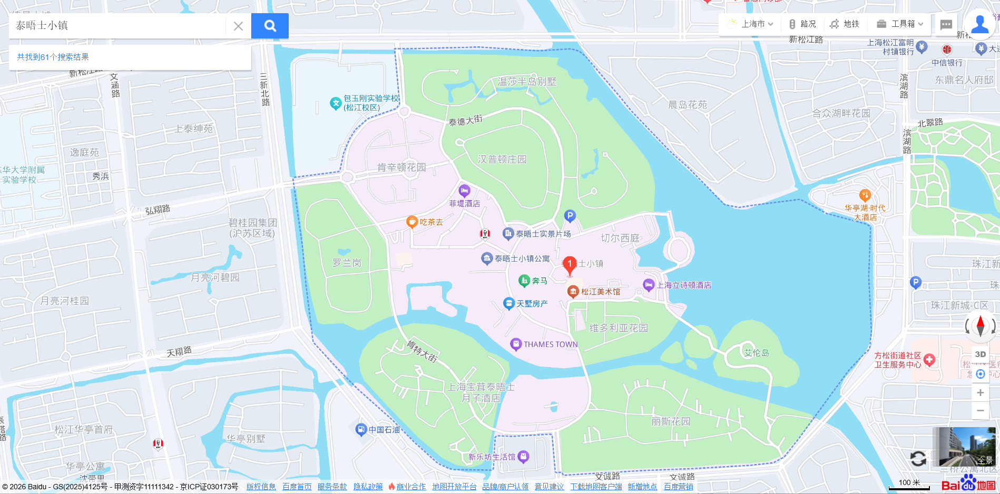

As you can see "Thames Town" is really small as it highlighted in blue
dashed line

I did search for it with it Chinese name "泰晤士小镇" which I got from
Wikipedia

Moving on, we'll use the street view of Baidu and search for the place,
if you notice the place we looking for has two roads close to each other
and some green space between so that the clue I used to find the place
fast and easily and since the town is too small you can quickly find it
and there is one place that match this so I went straight to it

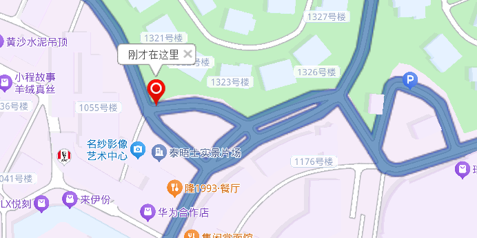

And after walking some steps I found the exact place

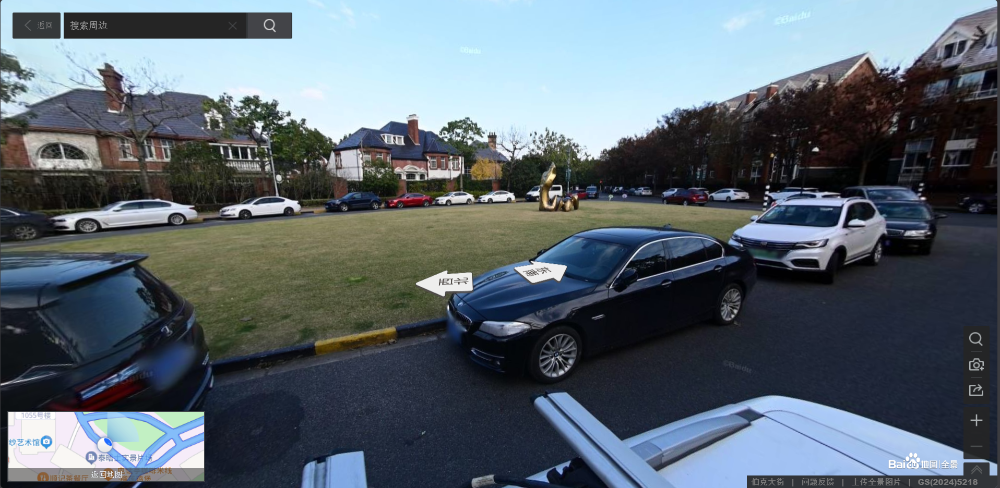

So the flag is

itc{ 13492381.73305203,3615831.58246096}
